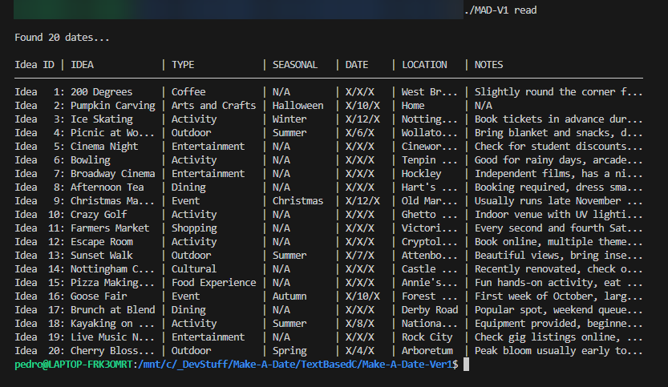
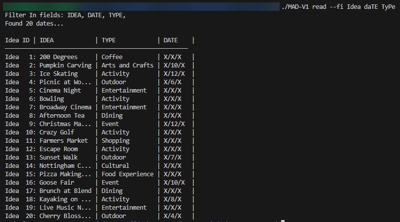
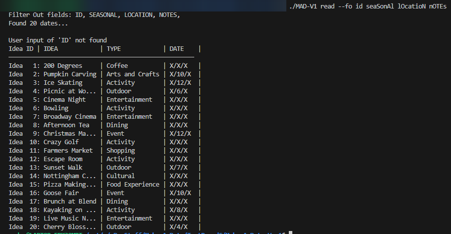
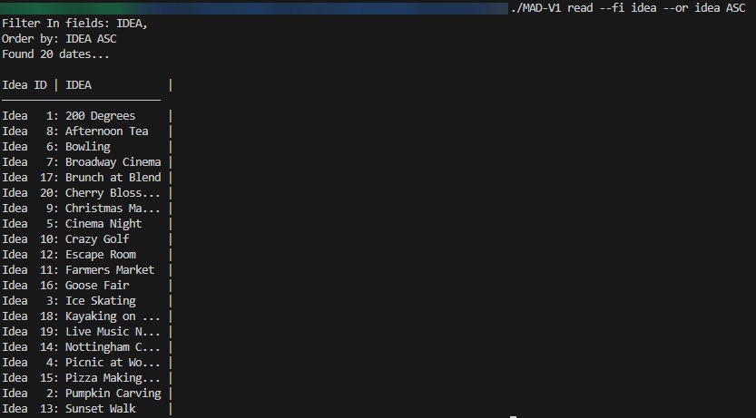
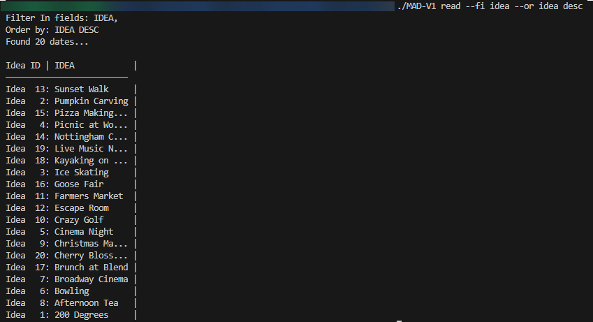
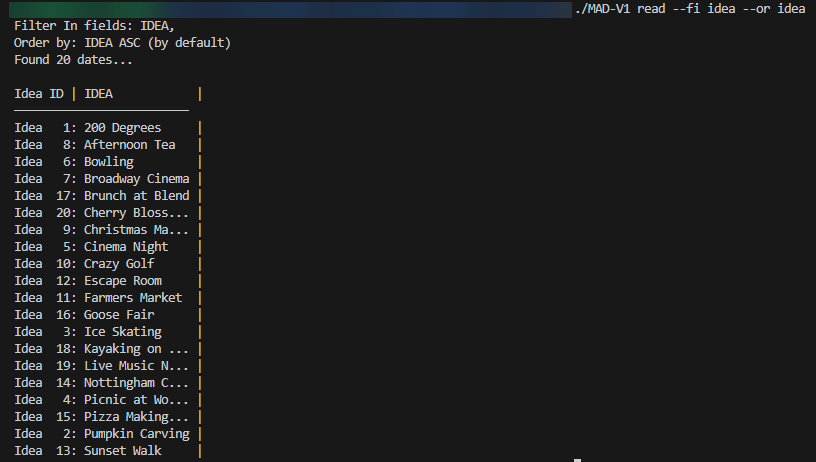
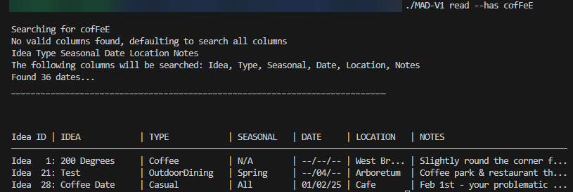
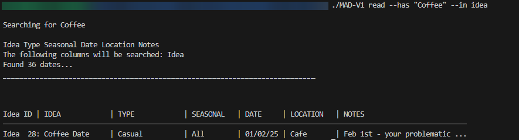
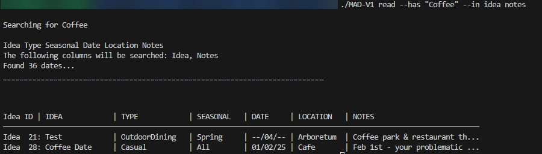

# Make A Date C Implementation README

This implementation specifically is mostly in the standard C library, the only external library it uses is [Dave Gambles cJSON Praser](https://github.com/DaveGamble/cJSON). To build the assembled code run download the library and you can compile with the following command line `gcc MAD-V1.c -o NAME -lcjson`

Once compiled, you as the user have various ways of using the application. The two main ways are [Reading](#Reading) and [Writing](#Writing) to the JSON file.

--- 

## Operations
### Reading
To read the JSON file stored in the same directory as the compiled code run the following command (it is case insensitive):
``` bash
./NAME read
```
This will read the entire JSON file in its intierty, and print out every piece of information as follows...



### Filtering
To specify if you would like to **F**ilter **i**n or **F**ilter **o**ut, you can use the arguments `--fi` or `--fo` **but not both!** These allow you to select what columns you would like to see.

``` bash
    ./NAME read --fi Idea daTE TyPe
```


Same can be achieved by filtering out! as follows, notice the additional headings in arguments

``` bash
    ./NAME read --fo Idea daTE TyPe
```



They take a list of column names, in any order and any case, as their arguments seperated by spaces e.g `name date type`. Any columns not found, i.e arguments with an invalid name, will not throw an error. The program will run and print the result but will warn the uer which columns were not found. The IDs will always be printed no matter what.

Alhough extremely similar, this approach to filter has its benifits. If you only wanted 1 column, instead of filtering out 5 options, you can instead filter in the one you want. Or in reverse, if you only wanted to drop one column you can simple type out one column name rather than 5.

### Ordering
Make-A-Date allows the user to print the output in a specified output for any column, ID included by using `--or COLUMN`. For string values the order is based alphabetically, where as ID and Date order is integer specified. 

The user can requeset the order to be **asc**ending or **desc**ending by following the `--or` flag with `ASC` or `DESC` after the chosen column, however if nothing is specified it automtically defaults to ascending.

``` bash
    ./NAME read --fi idea --or idea ASC
```


``` bash
    ./NAME read --fi idea --or idea desc
```


``` bash
    ./NAME read --fi idea --or id 
```


#### Date Syntax
The Date format is a little differet. Due to the limitations of C and my own preference - it is stored and treated as a string value. This allows for Date plans that are seasnoal or an annual event to be stored using X as a place holder. For example a pumkin carving date during halloween can be repreesnted as `"X/10/X"`.

This also comes with a drawback. As they are treated as string, when ordering by the `Date` column it is ordered alphanumerically. This means that the following dates `01/01/26`, `02/01/26` and `01/02/26` would be ordered as `01/01...`, `01/02/...` and `02/01...` due to the day being compared before the month or year. As search this required a unique solution.

To solve this, the strings are broken down into Day, Month and Year using a function and compared in reverse order. This allows the user to sort the date data by date correctly.

"--" values are treated as an infinitly large number and depending wether or not they fall on the day, month or year they are treated differently. For example, anything with the '--' notation in the year is towards the end as it can be done every year.

### Has
The `--has` option flag takes in a string value as an argument and allows the user to search the database, only returning strings that match the input. This allows the user to filter the search even more finely. 

For example, if a user wanted to return all dates that involve `coffee` or `happy hour`, they can run the program with their chosen filters and order followed by `--has coffee` or `--has happy hour`. This will limit what is printed to only include dates with those chosen words.

This input must be surrounded by `"`s for multiple words and is case insensitive.

```bash
    ./NAME read --has "cofFeE"
```


### In

The option argument `--in` allows the user to specify in which column(s) the search takes place in. It accepts only correct column names and will not run unless given a correct value. 

This limit in the search area not only allows for faster speeds when searching large data sets but also allows for more specific filter. For example, you may have saved a bar that also serves coffee and mention this in the notes, a specific cafe saved under the type "Coffee" and hypothetically a restaurant that has Coffee in Idea. If you wanted to specifically return the restaurant then the `--in Idea` option allows for this by limiting the search for coffee in idea.

The option must be followed by a correctly spelt column name and will accept multiple column names to better customise the search criteria.

```bash
    ./Name read --has "Coffee" --in idea
```


```bash
    ./Name read --has "Coffee" --in name notes
```


### Constants/Definitions
Due to the differing width of the users screen, and to further improve user experience and customisation, allows for different printing widths. Admitedly harder to customise, the user can adapt the C code to change how wide each column can be in character length.

At the top in constants the user will find the following:
```C
//Defining cloumn widths
    #define IDEA_WIDTH 15
    #define TYPE_WIDTH 15
    #define SEASONAL_WIDTH 10
    #define DATE_WIDTH 7
    #define LOCATION_WIDTH 10
    #define NOTES_WIDTH 30
```

These values are hard coded constants that allow the character width limits to be changed for each adn every column. For example, if the user didnt want to occupy the width of their screen with notes due to techincal limitations or preference, they can reduce the notes width, and where the notes would have overflown the program adds a "..." to signify it is wider than it is allowed to be.

### Writing [WIP]
The `write` command will allow the user to enter new date ideas without having to enter the JSON file and manually copy the format. This is done to reduce errors and simplify the process.

The user has two options to do this, they can either run the program with the `write` command and enter the details when prompted or can type the `write` command with **ALL** the necessary vaules entered at once.

If the desired input is more than one word long, the **user will be required** to enter the input surrounded in quotation marks.

```bash
    ./NAME write "Phantom Of The Opera" Play None 12/01/26 "Theatre Royal" n/a
```
[IMAGE-OF-WRITE-COMMAND-FOLLOWED-BY-ALL-COLs]


```bash
    ./NAME write
```
[IMAGE-OF-WRITE-COMMAND-A-FEW-STEPS-DOWN-THE-LINE]